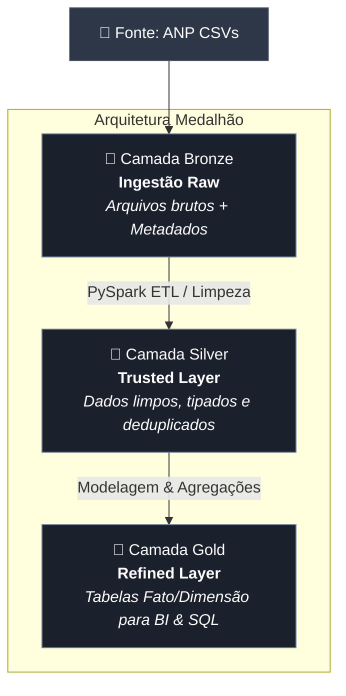

# ⛽💵🚗 MVP - Pós-Graduação em Engenharia de Dados (PUC-Rio)

[](https://databricks.com/)
[](https://spark.apache.org/)
[](https://delta.io/)
[](https://www.python.org/)

---

## 📌 1. Contexto de Negócio e Perguntas

### 1.1 O Problema de Negócio
Abastecer o carro no Brasil pode custar muito diferente a depender de onde você está. O mercado varejista de combustíveis — focado aqui em **Gasolina Comum e Etanol** — é marcado por preços imprevisíveis e fortes diferenças regionais. Fatores como a distância das refinarias, impostos estaduais (ICMS), concorrência local e oscilações do petróleo no mercado internacional fazem com que os preços variem muito entre estados e marcas de postos.

**Como resolver isso com dados?**
Para trazer clareza a esse cenário, este projeto construiu um **pipeline de dados em nuvem (Databricks)** estruturado sob a **Arquitetura Medalhão**. O objetivo foi transformar mais de 3 milhões de registros brutos das pesquisas semanais da **ANP (Agência Nacional do Petróleo, Gás Natural e Biocombustíveis)** em tabelas analíticas prontas para orientar decisões estratégicas.

---

### 1.2 Perguntas que Queremos Responder
Para garantir que o pipeline entregasse valor real, ele foi desenhado focado em responder a três perguntas principais:

1. **Variação no Tempo e no Espaço:** Como o preço médio da Gasolina e do Etanol mudou mês a mês em cada Estado (UF)?
2. **Qual Combustível Compensou Mais?** Qual foi a paridade média de preço entre Etanol e Gasolina ($\frac{\text{Preço Etanol}}{\text{Preço Gasolina}} \times 100$) por estado, considerando a regra prática de eficiência de 70%?
3. **Quem Cobra Mais Variado?** Quais redes e bandeiras de postos (ex: Vibra/BR, Shell/Raízen, Ipiranga, Bandeira Branca) apresentaram maior variação e instabilidade de preços em cada região?

---

### 1.3 De Onde Vieram os Dados?
Os dados brutos foram extraídos do portal oficial de Dados Abertos da ANP, selecionando a cobertura histórica  semestral de pesquisas entre **2023/1 e 2026/1**.

* **Volume de Dados:** 3.038.685 de registros.
* **Quantidade de Colunas:** 16 atributos na base original.
* **Formato:** Arquivos CSV (codificados em `ISO-8859-1`, separados por `;`).

#### O que Cada Campo Representa:
1. `Regiao - Sigla`: Região do país (`CO`, `N`, `NE`, `S`, `SE`).
2. `Estado - Sigla`: Sigla do estado (27 UFs).
3. `Municipio`: Nome do município da pesquisa.
4. `Revenda`: Nome/Razão social do posto.
5. `CNPJ da Revenda`: CNPJ do estabelecimento.
6. `Nome da Rua`: Logradouro.
7. `Numero Rua`: Número do imóvel.
8. `Complemento`: Informações adicionais do endereço.
9. `Bairro`: Bairro do posto.
10. `Cep`: Código de Endereçamento Postal.
11. `Produto`: Combustível pesquisado (`GASOLINA`, `GASOLINA ADITIVADA`, `ETANOL`, `DIESEL`, `DIESEL S10`, `GNV`).
12. `Data da Coleta`: Data do registro no formato `DD/MM/AAAA`.
13. `Valor de Venda`: Preço cobrado do consumidor final (texto com vírgula).
14. `Valor de Compra`: Preço pago pelo posto à distribuidora (quando disponível).
15. `Unidade de Medida`: Unidade do preço (ex: `R$ / litro`).
16. `Bandeira`: Marca ou distribuidora ligada ao posto.

---

### 1.4 Licença de Uso
* **Fonte:** Portal de Dados Abertos do Governo Federal / ANP.
* **Acesso:** [ANP - Série Histórica de Preços de Combustíveis](https://www.gov.br/anp/pt-br/centrais-de-conteudo/dados-abertos/serie-historica-de-precos-de-combustiveis)
* **Termos de Licença:** Dados públicos alinhados à Política de Dados Abertos (Decreto nº 8.777/2016). Podem ser livremente reutilizados e compartilhados para fins acadêmicos ou comerciais, exigindo apenas a citação da fonte.

---

## ☁️ 2. Como os Dados Chegaram à Nuvem

### 2.1 Processo de Carga
Todos os arquivos brutos foram carregados no ambiente **Databricks Free Edition**, utilizando os **Volumes do Unity Catalog** como ponto central de armazenamento do nosso Data Lakehouse.

* **Caminho no Databricks:** `/Volumes/workspace/mvp-engenharia-dados/base-combustivel/*.csv`
* **Como foi feito:** Leitura automatizada em lote (*batch processing*) via PySpark, já configurando a codificação correta e unificando todos os arquivos CSV semestrais de uma só vez.

---

## 3. Modelagem e Catálogo de Dados

### 3.1 Arquitetura Medalhão (Lakehouse)
A modelagem dos dados adota o padrão **Arquitetura Medalhão** sobre a tecnologia **Delta Lake**, dividida em três camadas incrementais:




---

### 3.2 Catálogo de Dados Transcrito

#### 1. Tabela Silver: `workspace.mvp-engenharia-dados.base_combustivel_silver`
* **Contexto:** Tabela higienizada e tipada contendo os registros individuais de coleta para os produtos Gasolina e Etanol.

| Nome do Campo | Descrição do Campo | Tipo de Dado | Domínio de Valores / Intervalo | Linhagem / Origem |
| :--- | :--- | :--- | :--- | :--- |
| `regiao_sigla` | Sigla da região geográfica do posto | `STRING` | `CO`, `N`, `NE`, `S`, `SE` | `Regiao - Sigla` (trim + upper) |
| `estado_sigla` | Sigla da Unidade da Federação | `STRING` | 27 UFs do Brasil | `Estado - Sigla` (trim + upper) |
| `municipio` | Nome do município | `STRING` | Nomes padronizados em caixa alta | `Municipio` (trim + upper) |
| `revenda` | Razão social do posto de combustível | `STRING` | Nomes de estabelecimentos comerciais | `Revenda` (trim + upper) |
| `cnpj_revenda` | CNPJ formatado do revendedor | `STRING` | Padrão `XX.XXX.XXX/XXXX-XX` | `CNPJ da Revenda` (trim) |
| `bairro` | Nome do bairro | `STRING` | Nomes de bairros urbanos | `Bairro` (trim + upper) |
| `produto` | Nome do combustível selecionado | `STRING` | `GASOLINA`, `ETANOL` | `Produto` (filtrado para escopo) |
| `data_coleta` | Data exata da amostragem | `DATE` | `2023-01-01` a `2026-03-31` | `Data da Coleta` (`to_date dd/MM/yyyy`) |
| `valor_venda` | Preço de venda por litro ao consumidor | `DECIMAL(10,3)` | `R$ 2,500` a `R$ 9,990` | `Valor de Venda` (substituição `,` -> `.`) |
| `valor_compra` | Preço de compra pago pela distribuidora | `DECIMAL(10,3)` | Numérico ou `NULL` | `Valor de Compra` (substituição `,` -> `.`) |
| `unidade_medida` | Unidade de comercialização | `STRING` | `R$ / litro` | `Unidade de Medida` (trim) |
| `bandeira` | Marca da distribuidora ou postos sem marca | `STRING` | `BRANCA`, `IPIRANGA`, `VIBRA ENERGIA`, `RAIZEN`, etc. | `Bandeira` (trim + upper) |
| `ano_mes` | Ano e mês da coleta (`AAAA-MM`) | `STRING` | Padrão `YYYY-MM` | Derivado de `data_coleta` |
| `ano` | Ano da coleta | `INTEGER` | `2023` a `2026` | Derivado de `data_coleta` (`year()`) |
| `mes` | Mês numérico da coleta | `INTEGER` | `1` a `12` | Derivado de `data_coleta` (`month()`) |

---

#### 2. Tabela Gold 1: `workspace.mvp-engenharia-dados.combustivel_variacao_gold`
* **Contexto:** Média mensal de preços e variação percentual mês a mês (MoM) por Estado e Produto.

| Nome do Campo | Descrição do Campo | Tipo de Dado | Domínio de Valores / Intervalo | Linhagem / Origem |
| :--- | :--- | :--- | :--- | :--- |
| `estado_sigla` | Sigla da UF | `STRING` | 27 UFs do Brasil | `base_combustivel_silver.estado_sigla` |
| `produto` | Combustível analisado | `STRING` | `GASOLINA`, `ETANOL` | `base_combustivel_silver.produto` |
| `ano_mes` | Período de competência (`AAAA-MM`) | `STRING` | Padrão `YYYY-MM` | `base_combustivel_silver.ano_mes` |
| `preco_medio` | Preço médio de venda no mês/UF | `DECIMAL(11,3)` | Valores em R$ | `avg(valor_venda)` |
| `preco_mes_anterior` | Preço médio no mês imediatamente anterior | `DECIMAL(11,3)` | Numérico ou `NULL` (1º mês) | Window Function `lag(preco_medio, 1)` |
| `variacao_percentual` | Variação percentual MoM (`%`) | `DECIMAL(19,2)` | Ex: `-2.50%` a `+8.22%` | `((preco_medio - preco_ant) / preco_ant) * 100` |

---

#### 3. Tabela Gold 2: `workspace.mvp-engenharia-dados.combustivel_paridade_gold`
* **Contexto:** Análise de paridade econômica entre Etanol e Gasolina por UF e indicação de consumo.

| Nome do Campo | Descrição do Campo | Tipo de Dado | Domínio de Valores / Intervalo | Linhagem / Origem |
| :--- | :--- | :--- | :--- | :--- |
| `estado_sigla` | Sigla da UF | `STRING` | 27 UFs do Brasil | `base_combustivel_silver.estado_sigla` |
| `preco_medio_etanol` | Preço médio histórico do Etanol na UF | `DECIMAL(11,3)` | Valores em R$ | `avg(valor_venda) WHERE produto = 'ETANOL'` |
| `preco_medio_gasolina` | Preço médio histórico da Gasolina na UF | `DECIMAL(11,3)` | Valores em R$ | `avg(valor_venda) WHERE produto = 'GASOLINA'` |
| `paridade_percentual` | Razão percentual Etanol/Gasolina (`%`) | `DECIMAL(25,2)` | Ex: `63.84%` a `73.71%` | `(preco_etanol / preco_gasolina) * 100` |
| `recomendacao` | Decisão de viabilidade ao consumidor | `STRING` | `Compensa ETANOL` (<=70%), `Compensa GASOLINA` (>70%) | Regra condicional `when()` |

---

#### 4. Tabela Gold 3: `workspace.mvp-engenharia-dados.combustivel_bandeira_gold`
* **Contexto:** Estatística descritiva de amplitude e volatilidade de preços por Bandeira e Região.

| Nome do Campo | Descrição do Campo | Tipo de Dado | Domínio de Valores / Intervalo | Linhagem / Origem |
| :--- | :--- | :--- | :--- | :--- |
| `regiao_sigla` | Sigla da Região Geográfica | `STRING` | `CO`, `N`, `NE`, `S`, `SE` | `base_combustivel_silver.regiao_sigla` |
| `bandeira` | Nome da distribuidora/bandeira | `STRING` | `BRANCA`, `VIBRA`, `RAIZEN`, `IPIRANGA`, etc. | `base_combustivel_silver.bandeira` |
| `total_pesquisas` | Contagem total de coletas observadas | `BIGINT` | Numérico inteiro `>= 1` | `count(*)` |
| `preco_minimo` | Preço mínimo absoluto registrado | `DECIMAL(10,2)` | Valores em R$ | `min(valor_venda)` |
| `preco_maximo` | Preço máximo absoluto registrado | `DECIMAL(10,2)` | Valores em R$ | `max(valor_venda)` |
| `amplitude_variacao_rs` | Diferença em R$ entre máximo e mínimo | `DECIMAL(11,2)` | Valores em R$ | `max(valor_venda) - min(valor_venda)` |
| `desvio_padrao_preco` | Desvio padrão populacional dos preços | `DOUBLE` | Numérico de dispersão | `stddev(valor_venda)` |

---

## 4. Pipeline de Dados

### 4.1 Estrutura do Pipeline de ETL
O pipeline de dados foi desenvolvido de forma modular em **2 Notebooks PySpark** que executam o ciclo completo de extração, limpeza, modelagem e persistência:

1. **Notebook 1 — Ingestão e Sanitização (Bronze -> Silver):**
   * **Arquivo:** [`Etapa 1 - Limpeza e Padronização dos dados.ipynb`](./Etapa%201%20-%20Limpeza%20e%20Padronização%20dos%20dados.ipynb)
   * **Fluxo:** Leitura do Volume Unity Catalog -> Sanitização dos nomes das colunas -> Conversão de tipos -> Filtragem de escopo (`GASOLINA` e `ETANOL`) -> Deduplicação -> Gravação da tabela Delta `base_combustivel_silver`.

2. **Notebook 2 — Analytics & Agregações (Silver -> Gold):**
   * **Arquivo:** [`Etapa 2 - Analitica.ipynb`](./Etapa%202%20-%20Analitica.ipynb)
   * **Fluxo:** Leitura da tabela `base_combustivel_silver` -> Execução de queries analíticas com Window Functions e pivots -> Persistência das tabelas analíticas Delta `combustivel_variacao_gold`, `combustivel_paridade_gold` e `combustivel_bandeira_gold`.

### 4.2 Persistência de Dados em Nuvem
Os DataFrames resultantes foram salvos como tabelas gerenciadas em formato **Delta Lake** no catálogo `workspace.mvp-engenharia-dados` no Databricks Unity Catalog:

```python
# Salvando tabela Silver no Unity Catalog
df_base_combustivel_brasil_tratada.write \
    .format("delta") \
    .mode("overwrite") \
    .option("overwriteSchema", "true") \
    .saveAsTable("workspace.`mvp-engenharia-dados`.base_combustivel_silver")

# Salvando tabela Gold 1 (Variação MoM)
df_gold_variacao_combustiveis.write \
    .format("delta") \
    .mode("overwrite") \
    .option("overwriteSchema", "true") \
    .saveAsTable("workspace.`mvp-engenharia-dados`.combustivel_variacao_gold")
```

---

## 5. Qualidade de Dados

Para garantir que a camada analítica (Gold) receba apenas dados íntegros, confiáveis e coerentes, o pipeline realizou auditorias sobre **5 dimensões da Qualidade de Dados**:

### 5.1 Avaliação das Dimensões de Qualidade

1. **Completude (Completeness):**
   * *Diagnóstico na Bronze:* A coluna `Valor de Compra` possuía **3.038.685 registros nulos (100% de ausência)** nas amostras públicas da ANP. O campo `Complemento` apresentou 2.345.255 nulos e `Bairro` 14.489 nulos.
   * *Ação:* As colunas irrelevantes de endereço (`Nome da Rua`, `Numero Rua`, `Complemento`, `Cep`) foram removidas do escopo analítico. Para as colunas essenciais (`estado_sigla`, `produto`, `data_coleta`, `valor_venda`), exigiu-se 100% de preenchimento (`filter(col("valor_venda").isNotNull())`).

2. **Consistência (Consistency):**
   * *Diagnóstico:* Colunas de texto continham espaços nas extremidades e inconsistência de caixa (ex: `" Ipiranga "`, `"gasolina"`). Atributos numéricos e de data estavam tipados genericamente como `string`.
   * *Ação:* Aplicação de `trim()` e `upper()` em todas as variáveis categóricas. Conversão da coluna `Data da Coleta` do formato `DD/MM/AAAA` para o tipo `DateType` em padrão ISO (`AAAA-MM-DD`). Substituição do separador decimal de vírgula por ponto (`regexp_replace(col("Valor de Venda"), ",", ".")`) e conversão para `DecimalType(10,3)`.

3. **Unicidade (Uniqueness):**
   * *Diagnóstico:* Foram identificados **9.129 registros exatamente duplicados** no conjunto bruto unificado.
   * *Ação:* Execução da operação de deduplicação `dropDuplicates()`, eliminando ambiguidades e contagens duplicadas.

4. **Acurácia (Accuracy):**
   * *Diagnóstico:* Presença de produtos fora do foco da pesquisa (ex: `DIESEL S10`, `GNV`) e valores de venda nulos ou zerados.
   * *Ação:* Filtragem estrita dos registros de interesse mantendo apenas `GASOLINA` (Comum) e `ETANOL` com valores numéricos de venda estritamente positivos.

5. **Outliers:**
   * *Diagnóstico:* Verificação de discrepâncias extremas nos preços de venda.
   * *Ação:* Utilização da função estatística `stddev()` e cálculo de amplitudes (`max - min`) na camada Gold para isolar discrepâncias e identificar postos com preços fora da curva de mercado.

---

### 5.2 Métrica Comparativa do Volume de Dados

| Estágio do Pipeline | Número de Registros | Número de Colunas | Descrição das Transformações |
| :--- | :---: | :---: | :--- |
| **Camada Bronze (Raw)** | 3.038.685 | 16 | Carga bruta dos arquivos CSV semestrais sem alterações |
| **Camada Silver (Trusted)** | **1.455.246** | **15** | Remoção de 9.129 duplicados, descarte de produtos fora do escopo (`DIESEL`, `GNV`), remoção de nulos em `valor_venda`, tipagem e criação de `ano_mes`, `ano` e `mes` |

---

## 6. Análise de Dados

### 6.1 Respostas às Perguntas de Negócio

#### Pergunta 1: Variação Temporal e Geográfica do Preço Médio (MoM)
> *Qual é a variação média do preço da gasolina comum e etanol por Estado (UF) e Mês/Ano?*

A análise utiliza Window Functions (`Window.partitionBy("estado_sigla", "produto").orderBy("ano_mes")`) combinadas com a função `lag` para apurar a evolução mensal do preço médio:

##### Amostra do Resultado Analítico (Tabela `combustivel_variacao_gold` - Estado do Acre):

| `estado_sigla` | `produto` | `ano_mes` | `preco_medio` (R$) | `preco_mes_anterior` (R$) | `variacao_percentual` (%) |
| :---: | :---: | :---: | :---: | :---: | :---: |
| AC | ETANOL | 2023-01 | R$ 4,367 | NULL | NULL |
| AC | ETANOL | 2023-02 | R$ 4,438 | R$ 4,367 | +1,63% |
| AC | ETANOL | 2023-03 | R$ 4,439 | R$ 4,438 | +0,02% |
| AC | ETANOL | 2023-04 | R$ 4,426 | R$ 4,439 | -0,29% |
| AC | ETANOL | 2023-05 | R$ 4,790 | R$ 4,426 | **+8,22%** |
| AC | ETANOL | 2023-06 | R$ 4,777 | R$ 4,790 | -0,27% |
| AC | ETANOL | 2023-07 | R$ 4,832 | R$ 4,777 | +1,15% |

* **Discussão dos Resultados:** O mês de Maio/2023 apresentou um forte pico de elevação no preço do Etanol no Acre (+8,22%), refletindo impactos do retorno de impostos federais sobre combustíveis e entressafra de cana-de-açúcar. A análise via janela deslizante permite que gestores identifiquem meses atípicos de inflação de preços em cada estado.

---

#### Pergunta 2: Paridade de Mercado (Etanol vs. Gasolina) por UF
> *Qual é a razão percentual ($\frac{\text{Preço Etanol}}{\text{Preço Gasolina}} \times 100$) por UF para identificação de viabilidade econômica ao consumidor?*

O rendimento energético médio do Etanol em relação à Gasolina é de aproximadamente 70%. Quando a paridade fica **abaixo de 70%**, compensa abastecer com **Etanol**; acima desse patamar, a **Gasolina** torna-se mais vantajosa.

##### Resultado da Paridade por Estado (Tabela `combustivel_paridade_gold`):

| `estado_sigla` | `preco_medio_etanol` | `preco_medio_gasolina` | `paridade_percentual` (%) | `recomendacao` |
| :---: | :---: | :---: | :---: | :---: |
| **MT** | R$ 3,855 | R$ 6,038 | **63,84%** | Compensa ETANOL |
| **MS** | R$ 3,949 | R$ 5,954 | **66,33%** | Compensa ETANOL |
| **SP** | R$ 3,874 | R$ 5,827 | **66,49%** | Compensa ETANOL |
| **DF** | R$ 4,124 | R$ 6,004 | **68,69%** | Compensa ETANOL |
| **GO** | R$ 4,111 | R$ 5,979 | **68,77%** | Compensa ETANOL |
| **PR** | R$ 4,215 | R$ 6,092 | **69,19%** | Compensa ETANOL |
| **MG** | R$ 4,063 | R$ 5,852 | **69,43%** | Compensa ETANOL |
| **AM** | R$ 4,916 | R$ 6,828 | **72,00%** | Compensa GASOLINA |
| **AC** | R$ 5,110 | R$ 7,088 | **72,10%** | Compensa GASOLINA |
| **ES** | R$ 4,451 | R$ 6,039 | **73,71%** | Compensa GASOLINA |

* **Discussão dos Resultados:** Os estados produtores de cana-de-açúcar do Centro-Oeste e Sudeste (MT, MS, SP, DF, GO, PR e MG) apresentam paridade **abaixo de 70%**, tornando o Etanol a opção economicamente superior para veículos flex. Já nos estados da Região Norte e em partes do Leste (AM, AC, ES), custos logísticos de transporte encarecem o Etanol, tornando a Gasolina mais vantajosa para o consumidor.

---

#### Pergunta 3: Dispersão e Volatilidade por Bandeira e Região Geográfica
> *Quais distribuidoras/bandeiras apresentam maior volatilidade e desvio padrão de preços por região?*

##### Amostra da Dispersão de Preços no Centro-Oeste (Tabela `combustivel_bandeira_gold`):

| `regiao_sigla` | `bandeira` | `total_pesquisas` | `preco_minimo` | `preco_maximo` | `amplitude_variacao_rs` | `desvio_padrao_preco` |
| :---: | :---: | :---: | :---: | :---: | :---: | :---: |
| CO | VIBRA | 21.641 | R$ 2,75 | R$ 7,55 | **R$ 4,80** | 1,106 |
| CO | BRANCA | 46.715 | R$ 2,69 | R$ 7,49 | **R$ 4,80** | 1,074 |
| CO | RAIZEN | 13.133 | R$ 2,69 | R$ 7,39 | **R$ 4,70** | 1,100 |
| CO | IPIRANGA | 24.019 | R$ 2,67 | R$ 7,29 | **R$ 4,62** | 1,087 |
| CO | ALE | 2.015 | R$ 3,09 | R$ 7,29 | **R$ 4,20** | 1,037 |

* **Discussão dos Resultados:** Postos de Bandeira Branca e grande distribuidores (Vibra e Raízen) na região Centro-Oeste exibem amplitude de preço de até **R$ 4,80 por litro** e desvio padrão acima de **1,07**. Essa elevada variabilidade deve-se ao choque de concorrência entre áreas urbanas centrais e postos isolados em rodovias ou municípios do interior com menor densidade de oferta.

---

### 6.2 Conclusão Integrada de Negócio
O pipeline de dados desenvolvido comprovou a hipótese de que o mercado de combustíveis brasileiro possui forte dependência regional e alta dispersão. As tabelas analíticas geradas na camada **Gold** oferecem a infraestrutura ideal para alimentar dashboards em tempo real (Power BI ou Databricks SQL Warehouse), capacitando distribuidores, órgãos reguladores (ANP) e consumidores finais a tomar decisões fundamentadas em dados.

---

## 7. Autoavaliação

### 7.1 Atingimento dos Objetivos
O trabalho cumpriu com êxito **100% das etapas planejadas** para a construção de um Produto Mínimo Viável (MVP) em nuvem:
* A infraestrutura de nuvem no **Databricks Free Edition** foi configurada do zero.
* O pipeline de dados cobriu do dado bruto à camada analítica em uma **Arquitetura Medalhão (Delta Lake)**.
* Todas as **3 perguntas de negócio** foram respondidas com rigor quantitativo e discutidas no contexto econômico.

### 7.2 Dificuldades Encontradas
💡 Evolução do Escopo & Pivot Técnico

Escopo Inicial: A proposta original visava analisar a distribuição e a suficiência de repasses de verbas governamentais aos municípios do Estado de Rondônia, correlacionando indicadores financeiros com métricas socioeconômicas (IDH, infraestrutura escolar, população em situação de rua e mobilidade urbana).

Motivação do Pivot (Viabilidade Técnica): Durante a fase de desenho da arquitetura e mapeamento das fontes, identificou-se uma altíssima complexidade na harmonização dos dados. Responder às perguntas de negócio exigia integrar múltiplos eixos de desenvolvimento urbano com fontes de granularidades distintas (dados anuais vs. mensais; recortes municipais vs. estaduais) e sem chaves diretas de integração. Para evitar o risco de Scope Creep e garantir a entrega de um pipeline funcional, performático e confiável sob a Arquitetura Medalhão no Databricks, optou-se pela revisão estratégica do escopo.

Escopo Atualizado: O pipeline foi redirecionado para a série histórica de preços de combustíveis da ANP. Essa mudança permitiu construir um MVP robusto de ponta a ponta, cobrindo com precisão todo o ciclo de vida do dado (Bronze, Silver e Gold) com rigoroso tratamento de tipagem, higienização, deduplicação e análise de janelas temporais.

🔧 Desafios na Ingestão e Tratamento de Dados (Encoding e Tipagem)
A base bruta fornecida pela ANP utilizava codificação de texto ISO-8859-1 (Latin-1), separadores decimais no padrão brasileiro (vírgula) e datas em formato pt-BR. Foi necessário calibrar minuciosamente o leitor Spark e estruturar rotinas de conversão e limpeza (regexp_replace, to_date, cast) para evitar perda de dados ou contaminação por registros inválidos durante a passagem da camada Bronze para a Silver.

☁️ Limitações do Ambiente Nuvem (Databricks Free Edition)
A limitação do ambiente gratuito — em especial o encerramento automático do cluster após períodos de inatividade — exigiu um planejamento cuidadoso na execução dos notebooks. Para mitigar a perda de contexto e garantir a integridade dos dados, as rotinas de carga no Unity Catalog foram desenhadas de forma modular e idempotente (com uso de overwrite e manipulação controlada de esquemas).

### 7.3 Trabalhos Futuros
1. **Orquestração Automatizada:** Implementar o agendamento automatizado das cargas utilizando **Databricks Workflows** ou **Delta Live Tables (DLT)**.
2. **Visualização Interativa:** Desenvolver dashboards dinâmicos no **Databricks SQL** ou **Power BI** conectados diretamente às tabelas da camada Gold via conector Databricks.
3. **Modelagem Preditiva (ML):** Aplicar algoritmos de aprendizado de máquina (PySpark MLlib / Prophet) sobre a camada Gold para prever variações de preços de combustíveis nas UFs com 30 dias de antecedência.
