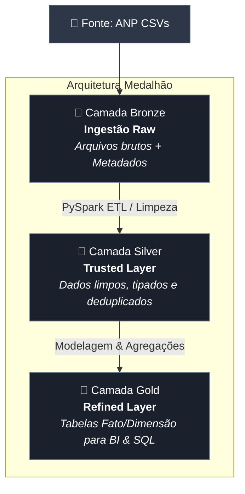

# MVP-pos-graduacao-PUC-Engenharia-de-Dados
Repositório para o trabalho de MVP de Engenharia de Dados desenvolvido na plataforma Databricks.

# ⛽ Pipeline de Análise de Preços de Combustíveis no Varejo Nacional

## 📌 Visão Geral do Projeto
Este projeto consiste na implementação de um pipeline de dados *end-to-end* em ambiente de nuvem (**Databricks**) para ingestão, tratamento e modelagem do histórico de preços de combustíveis (Gasolina e Etanol) no Brasil, utilizando dados abertos fornecidos pela **ANP (Agência Nacional do Petróleo, Gás Natural e Biocombustíveis)**.

O objetivo principal é transformar dados brutos em dados analíticos confiáveis, organizados em uma **Arquitetura Medalhão (Bronze, Silver e Gold)** sob o formato **Delta Lake**, respondendo a hipóteses estratégicas de precificação regional e paridade de mercado.

---

> 💡 **Evolução do Escopo & Pivot Técnico**
> 
> **Escopo Inicial:** A proposta original visava analisar a distribuição e suficiência das verbas governamentais repassadas aos municípios de Rondônia, correlacionando repasses financeiros com indicadores socioeconômicos (IDH, infraestrutura escolar, população em situação de rua, mobilidade, etc.).
> 
> **Motivação do Pivot (Análise de Viabilidade Técnica):** Durante a fase de desenho da arquitetura e mapeamento das fontes, identificou-se uma alta complexidade na harmonização dos dados. Responder à pergunta exigiria a integração de múltiplos eixos de desenvolvimento urbano (*Infraestrutura, Qualidade de Vida, Economia, entre outros...*) com fontes de **diferentes granularidades e domínios heterogêneos**. Para evitar um cenário de *Scope Creep* e garantir a entrega de um pipeline funcional, performático e confiável sob a Arquitetura Medalhão, optou-se pela revisão do escopo.
> 
> **Escopo Atualizado:** O pipeline foi redirecionado para o setor de combustíveis (ANP), com foco na análise temporal de preços (Gasolina e Etanol), paridade econômica por UF e variação por bandeiras. Essa escolha permitiu construir um MVP *end-to-end* robusto no Databricks, cobrindo todo o ciclo de vida do dado (Bronze, Silver e Gold) com elevado rigor de tipagem, limpeza e agregabilidade.

---

## 🎯 Problema & Perguntas de Negócio

O pipeline foi desenhado para processar os volumes históricos da ANP e responder às seguintes perguntas analíticas:

1. **Variação Temporal e Geográfica:** Qual é a variação média do preço da gasolina comum discriminada por Estado (UF) e Mês/Ano?
2. **Paridade de Mercado (Etanol vs. Gasolina):** Qual é a razão percentual ($\frac{\text{Preço Etanol}}{\text{Preço Gasolina}} \times 100$) por UF para identificação de viabilidade econômica ao consumidor?
3. **Dispersão por Bandeiras:** Quais distribuidoras/bandeiras (ex: BR/Vibra, Shell, Ipiranga, Branca) apresentam maior volatilidade e desvio padrão de preços por região geográfica?

---

## 🏗️ Arquitetura da Solução

O pipeline segue o padrão **Data Lakehouse** utilizando **Delta Lake** para garantir transações ACID, controle de esquema (*schema enforcement*) e alta performance de escrita/leitura.

## ⚙️ Detalhamento das Etapas & Notebooks do Projeto

O pipeline está estruturado e dividido em **2 notebooks principais** que executam o ciclo completo da Arquitetura Medalhão:

* 📄 **Etapa 1 (Bronze -> Silver):** Notebook responsável pela ingestão dos ficheiros brutos da ANP, validação do esquema (*schema enforcement*), conversão de tipos de dados, remoção de duplicados e normalização dos atributos geográficos e de estabelecimento.
* 📄 **Etapa 2 (Silver -> Gold):** Notebook responsável pelo processamento analítico, calculando agregações temporais, variação de preços e paridade entre combustíveis, persistindo as tabelas finais prontas para BI, por ano/mês .

---

### 1. Ingestão e Carga na Camada Bronze
- **Fonte de Dados:** Ficheiros no formato CSV contendo os registos de coletas semanais da ANP[cite: 3].
- 

Os dados brutos utilizados neste projeto foram extraídos da página oficial de **Dados Abertos da ANP (Agência Nacional do Petróleo, Gás Natural e Biocombustíveis)**, especificamente na seção da [Série Histórica de Preços de Combustíveis](https://www.gov.br/anp/pt-br/centrais-de-conteudo/dados-abertos/serie-historica-de-precos-de-combustiveis). Para este estudo, foi delimitado o recorte temporal **a partir do ano de 2023** em diante.
- **Origem: ** Arquivos extraídos de https://www.gov.br/anp/pt-br/centrais-de-conteudo/dados-abertos/serie-historica-de-precos-de-combustiveis?utm_source=gemini
- **Ações Realizadas:** Carga dos ficheiros brutos para o catálogo de dados, preservando a estrutura original e aplicando metadados de controle (como data de ingestão e nome da fonte) para auditoria e linhagem de dados.

### 2. Tratamento e Higienização na Camada Silver (Etapa 1)
- **Origem:** Tabela `base_combustivel_bronze`.
- **Limpeza e Padronização:**
  - Aplicação de *schema enforcement* e conversão explícita de tipos de dados (datas, valores monetários para tipo decimal/float).
  - Normalização de cadeias de caracteres (remoção de espaços desnecessários, uniformização de nomes de municípios, bairros e bandeiras).
  - Tratamento de valores nulos e remoção de registos duplicados.
- **Atributos Estruturados:** A tabela final `workspace.mvp-engenharia-dados.base_combustivel_silver` disponibiliza atributos organizados[cite: 3]:
  - **Dimensão Geográfica:** `regiao_sigla`, `estado_sigla`, `municipio`, `bairro`[cite: 3].
  - **Dimensão Estabelecimento:** `revenda`, `cnpj_revenda`, `bandeira`[cite: 3].
  - **Dimensão Produto & Tempo:** `produto`, `data_coleta`, `ano_mes`, `ano`, `mes`[cite: 3].
  - **Métricas Financeiras:** `valor_venda`, `valor_compra`, `unidade_medida`[cite: 3].

### 3. Agregação e Modelagem na Camada Gold (Etapa 2)
- **Origem:** `workspace.mvp-engenharia-dados.base_combustivel_silver`[cite: 3].
- **Processamento Analytics:**
  - Utilização de **PySpark SQL** e **Window Functions** (`pyspark.sql.window.Window`) para particionamento temporal e geográfico[cite: 3].
  - Cálculo de métricas financeiras acumuladas e janelas deslizantes[cite: 3]:
    - `avg` e `spark_round` para médias de preço de venda e compra[cite: 3].
    - `min`, `max` e `stddev` para identificação de discrepâncias e volatilidade de preços[cite: 3].
    - Função `lag` para apurar variações temporais de preços de venda entre períodos (MoM / WoW)[cite: 3].
- **Destino:** Tabelas agregadas e otimizadas em formato Delta Lake na camada **Gold**, prontas para consumo por dashboards de BI (Power BI, Databricks SQL) e relatórios estratégicos[cite: 3].
