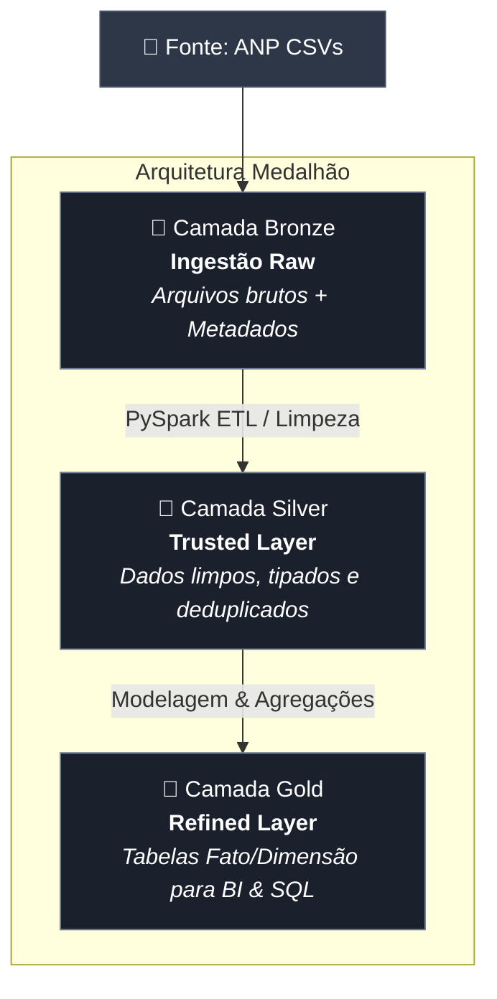
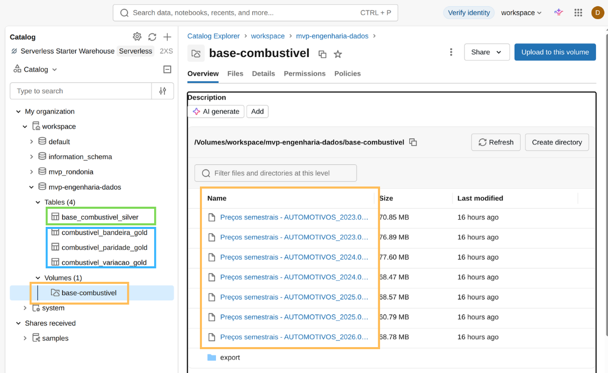
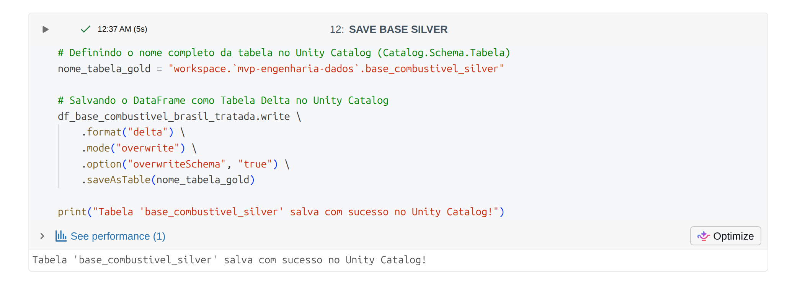
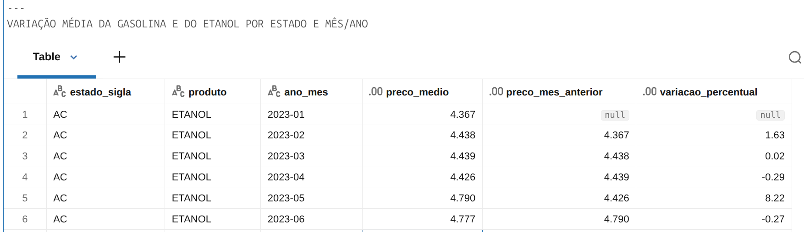
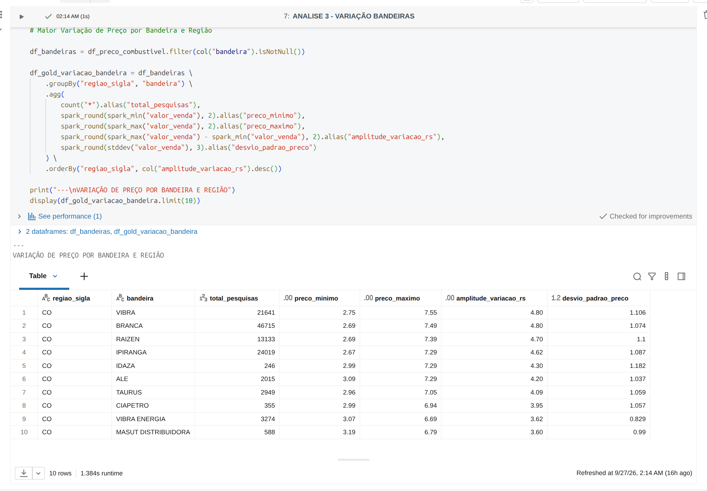

# MVP - Pós-Graduação em Engenharia de Dados (PUC-Rio)
# ⛽💵🚗 

[](https://databricks.com/)
[](https://spark.apache.org/)
[](https://delta.io/)
[](https://www.python.org/)

---

## 📌 1. Contexto de Negócio e Perguntas

### 1.1 O Problema de Negócio
Abastecer o carro no Brasil pode custar muito diferente a depender de onde você está. O mercado varejista de combustíveis — focado aqui em **Gasolina Comum e Etanol** — é marcado por preços imprevisíveis e fortes diferenças regionais. Fatores como a distância das refinarias, impostos estaduais (ICMS), concorrência local e oscilações do petróleo no mercado internacional fazem com que os preços variem muito entre estados e marcas de postos.

**Como resolver isso com dados?**
Para trazer clareza a esse cenário, este projeto construiu um **pipeline de dados em nuvem (Databricks)** estruturado sob a **Arquitetura Medalhão**. O objetivo foi transformar mais de 3 milhões de registros brutos das pesquisas semanais da **ANP (Agência Nacional do Petróleo, Gás Natural e Biocombustíveis)** em tabelas analíticas prontas para orientar decisões estratégicas.

---

### 1.2 Perguntas que Queremos Responder
Para garantir que o pipeline entregasse valor real, ele foi desenhado focado em responder a três perguntas principais:

1. **Variação no Tempo e no Espaço:** Como o preço médio da Gasolina e do Etanol mudou mês a mês em cada Estado (UF)?
2. **Qual Combustível Compensou Mais?** Qual foi a paridade média de preço entre Etanol e Gasolina ($\frac{\text{Preço Etanol}}{\text{Preço Gasolina}} \times 100$) por estado, considerando a regra prática de eficiência de 70%?
3. **Quem Cobra Mais Variado?** Quais redes e bandeiras de postos (ex: Vibra/BR, Shell/Raízen, Ipiranga, Bandeira Branca) apresentaram maior variação e instabilidade de preços em cada região?

---

### 1.3 De Onde Vieram os Dados?
Os dados brutos foram extraídos do portal oficial de Dados Abertos da ANP, selecionando a cobertura histórica  semestral de pesquisas entre **2023/1 e 2026/1**.

* **Volume de Dados:** 3.038.685 de registros.
* **Quantidade de Colunas:** 16 atributos na base original.
* **Formato:** Arquivos CSV (codificados em `ISO-8859-1`, separados por `;`).

#### O que Cada Campo Representa:

| Campo / Atributo | Descrição e Valores Aceitos |
| :--- | :--- |
| `Regiao - Sigla` | Região do país (`CO`, `N`, `NE`, `S`, `SE`) |
| `Estado - Sigla` | Sigla da Unidade da Federação (27 UFs) |
| `Municipio` | Nome do município da pesquisa |
| `Revenda` | Nome ou Razão Social do posto de combustível |
| `CNPJ da Revenda` | CNPJ do estabelecimento revendedor |
| `Nome da Rua` | Logradouro do endereço do posto |
| `Numero Rua` | Número do local do estabelecimento |
| `Complemento` | Informações adicionais do endereço |
| `Bairro` | Bairro onde o posto está localizado |
| `Cep` | Código de Endereçamento Postal (CEP) |
| `Produto` | Combustível pesquisado (`GASOLINA`, `GASOLINA ADITIVADA`, `ETANOL`, `DIESEL`, `DIESEL S10`, `GNV`) |
| `Data da Coleta` | Data do registro da amostragem no formato `DD/MM/AAAA` |
| `Valor de Venda` | Preço cobrado do consumidor final (formato texto com vírgula) |
| `Valor de Compra` | Preço pago pelo posto à distribuidora (quando disponível) |
| `Unidade de Medida` | Unidade de comercialização do preço (ex: `R$ / litro`) |
| `Bandeira` | Marca da distribuidora ou rede ligada ao posto |

---

### 1.4 Licença de Uso
* **Fonte:** Portal de Dados Abertos do Governo Federal / ANP.
* **Acesso:** [ANP - Série Histórica de Preços de Combustíveis](https://www.gov.br/anp/pt-br/centrais-de-conteudo/dados-abertos/serie-historica-de-precos-de-combustiveis)
* **Termos de Licença:** Dados públicos alinhados à Política de Dados Abertos (Decreto nº 8.777/2016). Podem ser livremente reutilizados e compartilhados para fins acadêmicos ou comerciais, exigindo apenas a citação da fonte.

---

## ☁️ 2. Como os Dados Chegaram à Nuvem

### 2.1 Processo de Carga
Todos os arquivos brutos foram carregados no ambiente **Databricks Free Edition**, utilizando os **Volumes do Unity Catalog** como ponto central de armazenamento do nosso Data Lakehouse.

* **Caminho no Databricks:** `/Volumes/workspace/mvp-engenharia-dados/base-combustivel/*.csv`
* **Como foi feito:** Leitura automatizada em lote (*batch processing*) via PySpark, já configurando a codificação correta e unificando todos os arquivos CSV semestrais de uma só vez.

---

## 🏛️ 3. Modelagem e Catálogo de Dados

### 3.1 Arquitetura Medalhão (Lakehouse)
A modelagem dos dados adota o padrão **Arquitetura Medalhão** sobre a tecnologia **Delta Lake**, dividida em três camadas incrementais:





##### Descrição da imagem: Print do *Databricks Catalog* com os dados brutos (em laranja) e dados silver (em verde) e dados gold (em azul).
---

### 3.2 Catálogo de Dados Transcrito

#### 3.2.1. Tabela Silver: `workspace.mvp-engenharia-dados.base_combustivel_silver`
* **Contexto:** Tabela higienizada e tipada contendo os registros individuais de coleta para os produtos Gasolina e Etanol.

| Nome do Campo | Descrição do Campo | Tipo de Dado | Domínio de Valores / Intervalo | Linhagem / Origem |
| :--- | :--- | :--- | :--- | :--- |
| `regiao_sigla` | Sigla da região geográfica do posto | `STRING` | `CO`, `N`, `NE`, `S`, `SE` | `Regiao - Sigla` (trim + upper) |
| `estado_sigla` | Sigla da Unidade da Federação | `STRING` | 27 UFs do Brasil | `Estado - Sigla` (trim + upper) |
| `municipio` | Nome do município | `STRING` | Nomes padronizados em caixa alta | `Municipio` (trim + upper) |
| `revenda` | Razão social do posto de combustível | `STRING` | Nomes de estabelecimentos comerciais | `Revenda` (trim + upper) |
| `cnpj_revenda` | CNPJ formatado do revendedor | `STRING` | Padrão `XX.XXX.XXX/XXXX-XX` | `CNPJ da Revenda` (trim) |
| `bairro` | Nome do bairro | `STRING` | Nomes de bairros urbanos | `Bairro` (trim + upper) |
| `produto` | Nome do combustível selecionado | `STRING` | `GASOLINA`, `ETANOL` | `Produto` (filtrado para escopo) |
| `data_coleta` | Data exata da amostragem | `DATE` | `2023-01-01` a `2026-03-31` | `Data da Coleta` (`to_date dd/MM/yyyy`) |
| `valor_venda` | Preço de venda por litro ao consumidor | `DECIMAL(10,3)` | `R$ 2,500` a `R$ 9,990` | `Valor de Venda` (substituição `,` -> `.`) |
| `valor_compra` | Preço de compra pago pela distribuidora | `DECIMAL(10,3)` | Numérico ou `NULL` | `Valor de Compra` (substituição `,` -> `.`) |
| `unidade_medida` | Unidade de comercialização | `STRING` | `R$ / litro` | `Unidade de Medida` (trim) |
| `bandeira` | Marca da distribuidora ou postos sem marca | `STRING` | `BRANCA`, `IPIRANGA`, `VIBRA ENERGIA`, `RAIZEN`, etc. | `Bandeira` (trim + upper) |
| `ano_mes` | Ano e mês da coleta (`AAAA-MM`) | `STRING` | Padrão `YYYY-MM` | Derivado de `data_coleta` |
| `ano` | Ano da coleta | `INTEGER` | `2023` a `2026` | Derivado de `data_coleta` (`year()`) |
| `mes` | Mês numérico da coleta | `INTEGER` | `1` a `12` | Derivado de `data_coleta` (`month()`) |

---

#### 3.2.2. Tabela Gold 1: `workspace.mvp-engenharia-dados.combustivel_variacao_gold`
* **Contexto:** Média mensal de preços e variação percentual mês a mês (MoM) por Estado e Produto.

| Nome do Campo | Descrição do Campo | Tipo de Dado | Domínio de Valores / Intervalo | Linhagem / Origem |
| :--- | :--- | :--- | :--- | :--- |
| `estado_sigla` | Sigla da UF | `STRING` | 27 UFs do Brasil | `base_combustivel_silver.estado_sigla` |
| `produto` | Combustível analisado | `STRING` | `GASOLINA`, `ETANOL` | `base_combustivel_silver.produto` |
| `ano_mes` | Período de competência (`AAAA-MM`) | `STRING` | Padrão `YYYY-MM` | `base_combustivel_silver.ano_mes` |
| `preco_medio` | Preço médio de venda no mês/UF | `DECIMAL(11,3)` | Valores em R$ | `avg(valor_venda)` |
| `preco_mes_anterior` | Preço médio no mês imediatamente anterior | `DECIMAL(11,3)` | Numérico ou `NULL` (1º mês) | Window Function `lag(preco_medio, 1)` |
| `variacao_percentual` | Variação percentual MoM (`%`) | `DECIMAL(19,2)` | Ex: `-2.50%` a `+8.22%` | `((preco_medio - preco_ant) / preco_ant) * 100` |

---

#### 3.2.3. Tabela Gold 2: `workspace.mvp-engenharia-dados.combustivel_paridade_gold`
* **Contexto:** Análise de paridade econômica entre Etanol e Gasolina por UF e indicação de consumo.

| Nome do Campo | Descrição do Campo | Tipo de Dado | Domínio de Valores / Intervalo | Linhagem / Origem |
| :--- | :--- | :--- | :--- | :--- |
| `estado_sigla` | Sigla da UF | `STRING` | 27 UFs do Brasil | `base_combustivel_silver.estado_sigla` |
| `preco_medio_etanol` | Preço médio histórico do Etanol na UF | `DECIMAL(11,3)` | Valores em R$ | `avg(valor_venda) WHERE produto = 'ETANOL'` |
| `preco_medio_gasolina` | Preço médio histórico da Gasolina na UF | `DECIMAL(11,3)` | Valores em R$ | `avg(valor_venda) WHERE produto = 'GASOLINA'` |
| `paridade_percentual` | Razão percentual Etanol/Gasolina (`%`) | `DECIMAL(25,2)` | Ex: `63.84%` a `73.71%` | `(preco_etanol / preco_gasolina) * 100` |
| `recomendacao` | Decisão de viabilidade ao consumidor | `STRING` | `Compensa ETANOL` (<=70%), `Compensa GASOLINA` (>70%) | Regra condicional `when()` |

---

#### 3.2.4. Tabela Gold 3: `workspace.mvp-engenharia-dados.combustivel_bandeira_gold`
* **Contexto:** Estatística descritiva de amplitude e volatilidade de preços por Bandeira e Região.

| Nome do Campo | Descrição do Campo | Tipo de Dado | Domínio de Valores / Intervalo | Linhagem / Origem |
| :--- | :--- | :--- | :--- | :--- |
| `regiao_sigla` | Sigla da Região Geográfica | `STRING` | `CO`, `N`, `NE`, `S`, `SE` | `base_combustivel_silver.regiao_sigla` |
| `bandeira` | Nome da distribuidora/bandeira | `STRING` | `BRANCA`, `VIBRA`, `RAIZEN`, `IPIRANGA`, etc. | `base_combustivel_silver.bandeira` |
| `total_pesquisas` | Contagem total de coletas observadas | `BIGINT` | Numérico inteiro `>= 1` | `count(*)` |
| `preco_minimo` | Preço mínimo absoluto registrado | `DECIMAL(10,2)` | Valores em R$ | `min(valor_venda)` |
| `preco_maximo` | Preço máximo absoluto registrado | `DECIMAL(10,2)` | Valores em R$ | `max(valor_venda)` |
| `amplitude_variacao_rs` | Diferença em R$ entre máximo e mínimo | `DECIMAL(11,2)` | Valores em R$ | `max(valor_venda) - min(valor_venda)` |
| `desvio_padrao_preco` | Desvio padrão populacional dos preços | `DOUBLE` | Numérico de dispersão | `stddev(valor_venda)` |

---

## ⚙️ 4. Pipeline de Dados

### 4.1 Estrutura do Pipeline de ETL
O pipeline de dados foi desenvolvido de forma modular em **2 Notebooks PySpark** que executam o ciclo completo de extração, limpeza, modelagem e persistência:

4.1.1. **Notebook 1 — Ingestão e Sanitização (Bronze -> Silver):**
   * **Arquivo:** [`Etapa 1 - Limpeza e Padronização dos dados.ipynb`](./Etapa%201%20-%20Limpeza%20e%20Padronização%20dos%20dados.ipynb)
   * **Fluxo:** Leitura do Volume Unity Catalog -> Sanitização dos nomes das colunas -> Conversão de tipos -> Filtragem de escopo (`GASOLINA` e `ETANOL`) -> Deduplicação -> Gravação da tabela Delta `base_combustivel_silver`.



##### Descrição da imagem: Print do código que salva tbl na etapa silver

4.1.2. **Notebook 2 — Analytics & Agregações (Silver -> Gold):**
   * **Arquivo:** [`Etapa 2 - Analitica.ipynb`](./Etapa%202%20-%20Analitica.ipynb)
   * **Fluxo:** Leitura da tabela `base_combustivel_silver` -> Execução de queries analíticas com Window Functions e pivots -> Persistência das tabelas analíticas Delta `combustivel_variacao_gold`, `combustivel_paridade_gold` e `combustivel_bandeira_gold`.


##### Descrição da imagem: Print do código que processa etapa de tbl 1 gold


##### Descrição da imagem: Print do código que processa etapa de tbl 3 gold

### 4.2 Persistência de Dados em Nuvem
Os DataFrames resultantes foram salvos como tabelas gerenciadas em formato **Delta Lake** no catálogo `workspace.mvp-engenharia-dados` no Databricks Unity Catalog:

```python
# Salvando tabela Silver no Unity Catalog
df_base_combustivel_brasil_tratada.write \
    .format("delta") \
    .mode("overwrite") \
    .option("overwriteSchema", "true") \
    .saveAsTable("workspace.`mvp-engenharia-dados`.base_combustivel_silver")

# Salvando tabela Gold 1 (Variação MoM)
df_gold_variacao_combustiveis.write \
    .format("delta") \
    .mode("overwrite") \
    .option("overwriteSchema", "true") \
    .saveAsTable("workspace.`mvp-engenharia-dados`.combustivel_variacao_gold")
```

---

## 🔍 5. Qualidade de Dados

Para garantir que a camada analítica (Gold) recebesse apenas dados íntegros, confiáveis e coerentes, auditamos o conjunto bruto sob **5 pilares de qualidade de dados**:

1. **Completude (Dados Faltantes):** 
   * *Diagnóstico:* A coluna `Valor de Compra` estava 100% vazia nos dados públicos da ANP. O campo `Complemento` e dados detalhados de endereço tinham alta proporção de nulos.
   * *Ação:* Removemos colunas irrelevantes de endereço (`Nome da Rua`, `Numero Rua`, `Complemento`, `Cep`) e garantimos 100% de preenchimento nos campos essenciais (`estado_sigla`, `produto`, `data_coleta`, `valor_venda`).
2. **Padronização (Consistência):** 
   * *Diagnóstico:* Variáveis de texto apresentavam inconsistência de caixa e espaços extras (ex: `" Ipiranga "`, `"gasolina"`). Preços e datas estavam tipados como texto em padrão brasileiro (vírgula decimal e formato `DD/MM/AAAA`).
   * *Ação:* Aplicamos `trim()` e `upper()` em todas as categóricas. Convertemos as datas para `DateType` (`AAAA-MM-DD`) e tratamos os preços com `regexp_replace()` para substituição de vírgula por ponto, convertendo para `DecimalType(10,3)`.
3. **Eliminação de Duplicatas (Unicidade):** 
   * *Diagnóstico:* Identificamos **9.129 registros exatamente duplicados** na base bruta.
   * *Ação:* Executamos a deduplicação com `dropDuplicates()`, garantindo amostragens únicas.
4. **Foco no Objetivo (Acurácia):** 
   * *Diagnóstico:* Presença de combustíveis fora do escopo do estudo (`DIESEL`, `GNV`) e preços zerados.
   * *Ação:* Filtramos estritamente os produtos `GASOLINA` e `ETANOL` com preços de venda positivos.
5. **Acompanhamento de Extremos (Outliers):** 
   * *Diagnóstico:* Necessidade de isolar discrepâncias extremas nos valores de venda.
   * *Ação:* Calculamos o desvio padrão (`stddev`) e amplitudes de preço na camada Gold para identificar distorções operacionais nos postos.

---

### Resumo da Transformação dos Dados

| Estágio do Pipeline | Registros | Colunas | O que mudou? |
| :--- | :---: | :---: | :--- |
| **Camada Bronze (Bruto)** | 3.038.685 | 16 | Carga bruta dos arquivos CSV semestrais da ANP sem alterações. |
| **Camada Silver (Limpo)** | **1.455.246** | **15** | Remoção de 9.129 duplicatas, descarte de produtos fora do escopo, tratamento de nulos, tipagem e criação das colunas `ano_mes`, `ano` e `mes`. |

---

## 📊 6. Análises e Resultados Encontrados

### 6.1 Respondendo às Perguntas de Negócio

#### 🟢 Pergunta 1: Como os preços variaram ao longo dos meses em cada Estado?
*Utilizamos Window Functions combinadas com a função `lag` para apurar a evolução mensal do preço médio e a variação MoM (Month-over-Month).*

##### Amostra do Resultado (Tabela `combustivel_variacao_gold` - Estado do Acre):

| Estado (`estado_sigla`) | Combustível (`produto`) | Período (`ano_mes`) | Preço Médio (`preco_medio`) | Mês Anterior (`preco_mes_anterior`) | Variação MoM (`variacao_percentual`) |
| :---: | :---: | :---: | :---: | :---: | :---: |
| AC | ETANOL | 2023-01 | R$ 4,367 | - | - |
| AC | ETANOL | 2023-02 | R$ 4,438 | R$ 4,367 | +1,63% |
| AC | ETANOL | 2023-03 | R$ 4,439 | R$ 4,438 | +0,02% |
| AC | ETANOL | 2023-04 | R$ 4,426 | R$ 4,439 | -0,29% |
| AC | ETANOL | 2023-05 | R$ 4,790 | R$ 4,426 | **+8,22%** |
| AC | ETANOL | 2023-06 | R$ 4,777 | R$ 4,790 | -0,27% |

* **O que o dado revela:** Em maio de 2023, o preço do Etanol no Acre sofreu um salto de **+8,22%** em um único mês. A análise por janela deslizante permitiu correlacionar essa alta atípica com o retorno da reoneração de impostos federais e a entressafra da cana-de-açúcar, fornecendo rastreabilidade para diagnósticos econômicos regionais.

---

#### 🟢 Pergunta 2: Em quais estados valeu a pena abastecer com Etanol?
*Considerando a eficiência média do Etanol equivalente a 70% da Gasolina, avaliamos a razão de preços por estado. Quando a paridade fica **igual ou abaixo de 70%**, o **Etanol** é a opção mais vantajosa.*

##### Resultado da Paridade por Estado (Tabela `combustivel_paridade_gold`):

| Estado (`estado_sigla`) | Média Etanol (`preco_medio_etanol`) | Média Gasolina (`preco_medio_gasolina`) | Paridade (`paridade_percentual`) | Recomendação (`recomendacao`) |
| :---: | :---: | :---: | :---: | :---: |
| **MT** | R$ 3,855 | R$ 6,038 | **63,84%** | Compensa ETANOL |
| **MS** | R$ 3,949 | R$ 5,954 | **66,33%** | Compensa ETANOL |
| **SP** | R$ 3,874 | R$ 5,827 | **66,49%** | Compensa ETANOL |
| **GO** | R$ 4,111 | R$ 5,979 | **68,77%** | Compensa ETANOL |
| **MG** | R$ 4,063 | R$ 5,852 | **69,43%** | Compensa ETANOL |
| **AM** | R$ 4,916 | R$ 6,828 | **72,00%** | Compensa GASOLINA |
| **AC** | R$ 5,110 | R$ 7,088 | **72,10%** | Compensa GASOLINA |
| **ES** | R$ 4,451 | R$ 6,039 | **73,71%** | Compensa GASOLINA |

* **O que o dado revela:** Nos estados produtores das regiões Centro-Oeste e Sudeste (MT, MS, SP, GO e MG), a paridade manteve-se abaixo dos 70%, consolidando o **Etanol** como escolha economicamente superior. Em contrapartida, nas regiões Norte e no Espírito Santo, gargalos logísticos e custos de frete encarecem o Etanol, tornando a **Gasolina** a opção mais rentável.

---

#### 🟢 Pergunta 3: Qual a diferença de preço entre as marcas de postos?
*Analisamos a volatilidade e a amplitude (preço máximo menos preço mínimo) das distribuidoras em cada região geográfica.*

##### Amostra do Centro-Oeste (Tabela `combustivel_bandeira_gold`):

| Região (`regiao_sigla`) | Bandeira (`bandeira`) | Pesquisas (`total_pesquisas`) | Menor Preço (`preco_minimo`) | Maior Preço (`preco_maximo`) | Amplitude (`amplitude_variacao_rs`) | Desvio Padrão (`desvio_padrao_preco`) |
| :---: | :---: | :---: | :---: | :---: | :---: | :---: |
| CO | VIBRA | 21.641 | R$ 2,75 | R$ 7,55 | **R$ 4,80** | 1,106 |
| CO | BRANCA | 46.715 | R$ 2,69 | R$ 7,49 | **R$ 4,80** | 1,074 |
| CO | RAIZEN | 13.133 | R$ 2,69 | R$ 7,39 | **R$ 4,70** | 1,100 |
| CO | IPIRANGA | 24.019 | R$ 2,67 | R$ 7,29 | **R$ 4,62** | 1,087 |

* **O que o dado revela:** Tanto postos independentes ("Bandeira Branca") quanto grandes distribuidoras (Vibra e Raízen) na região Centro-Oeste apresentaram variação de até **R$ 4,80 por litro** e desvio padrão elevado (acima de 1,07). Isso demonstra uma forte dispersão motivada pela concorrência acirrada em zonas urbanas em contraste com postos isolados em rodovias.

---

### 6.2 Conclusão Integrada de Negócio
O pipeline de dados construído comprovou a hipótese inicial: o mercado de combustíveis no Brasil é fortemente marcado por assimetria regional e alta amplitude de preços. 

A estrutura Delta Lake entregue na camada **Gold** fornece a base ideal para alimentar relatórios em tempo real (Power BI ou Databricks SQL Warehouse), capacitando órgãos reguladores, distribuidoras e consumidores a tomarem decisões pautadas em dados consolidados.

Como complemento dessa demanda, adicionei uma **Etapa 3**, com consultas prévias baseadas nas tabelas GOLD .

---

## 🎯 7. Autoavaliação do Projeto

### 7.1 Atingimento dos Objetivos
**Sim, 100% dos objetivos do MVP foram atingidos com êxito:**
* A infraestrutura de nuvem no **Databricks Free Edition** foi configurada e integrada do zero.
* O fluxo de engenharia cobriu do dado bruto à camada analítica sob a **Arquitetura Medalhão (Delta Lake)**.
* As **3 perguntas de negócio** foram respondidas com validação técnica, estatística e discussão contextualizada.

---

### 7.2 Dificuldades Encontradas

💡 **Evolução do Escopo & Pivot Técnico**
* **Escopo Inicial:** A proposta original visava analisar a distribuição e suficiência de verbas governamentais aos municípios do Estado de Rondônia, correlacionando repasses financeiros com indicadores socioeconômicos (IDH, infraestrutura escolar, população em situação de rua, mobilidade urbana).
* **Motivação do Pivot:** Durante o mapeamento das fontes, identificou-se alta complexidade na harmonização das bases. Responder ao problema exigia integrar fontes de granularidades heterogêneas (dados anuais vs. mensais; municipais vs. estaduais) sem chaves diretas de ligação. Para evitar o acúmulo de atrasos (*Scope Creep*) e garantir um pipeline funcional e confiável sob a Arquitetura Medalhão no Databricks, optou-se pela revisão do escopo.
* **Escopo Atualizado:** O pipeline foi redirecionado para a série histórica da ANP, permitindo construir um MVP robusto de ponta a ponta no Databricks, cobrindo o ciclo de vida do dado (Bronze, Silver e Gold) com tratamento de tipagem, higienização, deduplicação e análise de janelas temporais.

🔧 **Tratamento de Codificação e Tipagem**
A base bruta da ANP utilizava codificação de texto *ISO-8859-1*, separadores monetários em vírgula e datas no formato pt-BR. Foi necessário calibrar cuidadosamente o leitor Spark e funções de conversão (`regexp_replace`, `to_date`, `cast`) para evitar perda de registros.

☁️ **Limitações do Ambiente Nuvem (Databricks Free Edition)**
O encerramento automático de *clusters* inativos no ambiente gratuito exigiu a otimização das tarefas e a garantia de persistência idempotente (`overwriteSchema`) no Unity Catalog.

---

### 🔮 7.3 Trabalhos Futuros
1. **Orquestração Automatizada:** Agendar execuções periódicas do pipeline utilizando **Databricks Workflows** ou **Delta Live Tables (DLT)**.
2. **Visualização Interativa:** Conectar as tabelas da camada Gold diretamente ao **Power BI** ou **Databricks SQL Dashboards**.
3. **Modelagem Preditiva (ML):** Aplicar algoritmos de aprendizado de máquina (PySpark MLlib) para prever tendências e oscilações de preços nas UFs com 30 dias de antecedência.
